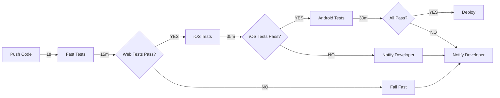

# Flutter Multi-Platform Testing Comparison Matrix

## Overview

This document provides guidance on which testing platform to use for different scenarios in your Flutter application.

## Quick Reference

| Platform | Startup | Build | Test Exec | Total | Best For | When NOT To Use |
|----------|---------|-------|-----------|-------|----------|-----------------|
| **Web (HTML)** | <1s | 30-60s | 5-10m | **10-15m** ⚡ | Quick feedback, CI/CD, UI tests | Platform-specific features |
| **Web (CanvasKit)** | <1s | 45-90s | 5-10m | **12-18m** | Rendering validation | Performance-critical apps |
| **iOS Simulator** | 60-120s | 30-60s | 15-20m | **25-35m** 🍎 | Release validation, native features | Quick local feedback |
| **Android Emulator** | 90-180s | 45-90s | 10-15m | **20-30m** | Linux CI/CD, Android-specific | macOS without Linux VM |

---

## Platform Feature Support

### Web Platform (Chrome/Chromium)

**✅ Supported Features:**
- ✅ Material Design widgets
- ✅ Cupertino (iOS-style) widgets
- ✅ Navigation and routing
- ✅ Forms and input fields
- ✅ API calls and networking
- ✅ State management (Provider, Riverpod, etc.)
- ✅ Animations and transitions
- ✅ SVG rendering (with flutter_svg)
- ✅ HTML rendering (with flutter_html)
- ✅ Image loading and caching
- ✅ Responsive design testing
- ✅ Accessibility testing

**❌ Unsupported Features:**
- ❌ iOS-specific APIs (Face ID, HomeKit, etc.)
- ❌ Android-specific APIs (fingerprint, NFC, etc.)
- ❌ Platform channels (native code)
- ❌ Native module implementation
- ❌ Device sensors (accelerometer, gyroscope)
- ❌ Camera/microphone access
- ❌ File system access (limited by browser)
- ❌ Low-level graphics APIs
- ❌ Bluetooth/USB communication

### iOS Simulator Platform

**✅ Supported Features:**
- ✅ All Material/Cupertino widgets
- ✅ iOS-specific APIs (Face ID, HomeKit, etc.)
- ✅ Platform channels for native code
- ✅ Device sensors
- ✅ Camera functionality
- ✅ File system access
- ✅ iOS keyboard and input
- ✅ Full rendering fidelity
- ✅ Real device behavior simulation
- ✅ Performance profiling

**❌ Limitations:**
- ❌ Slower execution (25-35 minutes)
- ❌ Requires macOS + Xcode
- ❌ Requires simulator setup
- ❌ Resource-intensive
- ❌ Cannot run on Linux CI/CD

### Android Emulator Platform

**✅ Supported Features:**
- ✅ All Material/Cupertino widgets
- ✅ Android-specific APIs
- ✅ Platform channels for native code
- ✅ Device sensors
- ✅ Camera functionality
- ✅ File system access
- ✅ Android keyboard and input
- ✅ Real device behavior simulation

**❌ Limitations:**
- ❌ Slow execution (20-30 minutes)
- ❌ Requires /dev/kvm (Linux only)
- ❌ Significant setup required
- ❌ Resource-intensive
- ❌ Not suitable for quick feedback

---

## Test Scenario Decision Tree

### I need quick feedback during development
```
↓
Are you testing platform-specific code?
│
├─ NO  → Use WEB (10-15 min) ⚡
│
└─ YES → Use iOS Simulator (25-35 min) 🍎
```

### I'm testing before a commit
```
↓
Required minimum tests:
├─ Web tests (must pass) ⚡
├─ iOS Simulator (if touching native code) 🍎
└─ Total time: 10-30 minutes
```

### I'm setting up CI/CD pipeline
```
↓
Fast Feedback Job (first to run):
├─ Web tests (10-15 min) ⚡
├─ Lint/format checks
├─ Unit tests
│
Parallel with web tests (for more coverage):
├─ iOS Simulator tests (25-35 min) 🍎  [macOS agents]
└─ Android Emulator tests (20-30 min)    [Linux agents]
│
Result: Fast feedback in 15 min, full coverage in 30-35 min
```

### I found a bug and need to reproduce it
```
↓
Is it UI/interaction related?
│
├─ YES → Start with Web (quickest repro) ⚡
│        Then verify on iOS/Android
│
└─ NO (platform-specific) → Test on specific platform 🍎
```

### I'm about to release
```
↓
Required tests (in order):
│
1. Web tests (quick sanity check) ⚡
   └─ Should complete in 15 min
│
2. iOS Simulator tests (full validation) 🍎
   └─ Should complete in 35 min
│
3. Optional: Android Emulator (final check)
   └─ Should complete in 30 min
│
Total: 45-65 minutes for full validation
```

---

## Platform-Specific Test Coverage

### What to test on WEB ⚡

```dart
// ✅ Test these on web (faster feedback)

testWidgets('Login flow', (tester) async {
  // UI widget rendering
  await tester.pumpWidget(MyApp());
  expect(find.byType(LoginPage), findsOneWidget);
  
  // Form interactions
  await tester.enterText(find.byType(TextField), 'email@example.com');
  await tester.tap(find.byType(ElevatedButton));
  
  // Navigation
  await tester.pumpAndSettle();
  expect(find.byType(HomePage), findsOneWidget);
  
  // API calls to Matrix server
  // (uses real HTTP, not platform channels)
});

testWidgets('Feed rendering', (tester) async {
  // Widget rendering
  // List scrolling
  // Image loading
  // Animations
});

testWidgets('Post creation', (tester) async {
  // Form submission
  // State management
  // API integration
});

testWidgets('Responsive design', (tester) async {
  // Test different viewport sizes
  addTearDown(tester.binding.window.physicalSizeTestValue = const Size(600, 800));
  addTearDown(tester.binding.window.devicePixelRatioTestValue = 1.0);
  
  // Verify layout adapts correctly
});
```

### What to test on iOS/Android 🍎

```dart
// ✅ Test these ONLY on native platforms

testWidgets('Face ID authentication', (tester) async {
  // This requires iOS platform channel
  // Can only test on iOS Simulator
});

testWidgets('Fingerprint sensor', (tester) async {
  // Android-specific
  // Can only test on Android Emulator
});

testWidgets('Camera capture', (tester) async {
  // Platform-specific camera APIs
  // Requires native platform
});

testWidgets('Location services', (tester) async {
  // Native location APIs
  // Requires device/emulator
});

testWidgets('File system access', (tester) async {
  // Native file APIs with permissions
  // Limited on web, full on native
});
```

---

## Runtime Breakdown

### Web Platform (HTML Renderer)

```
Total: 10-15 minutes

├─ Setup & validation        : 0-5s
├─ Dependency resolution    : 10-30s
├─ Build for web            : 30-60s
├─ Test framework startup   : 5-10s
├─ Test execution           : 5-10 min
└─ Result parsing           : 5-10s
```

### iOS Simulator

```
Total: 25-35 minutes

├─ Simulator search         : 5-10s
├─ Simulator boot           : 60-120s
├─ Simulator wait           : 30-60s
├─ Dependency resolution    : 10-30s
├─ Build for iOS            : 30-60s
├─ Test framework startup   : 10-20s
├─ Test execution           : 15-20 min
└─ Result parsing           : 10-20s
```

### Android Emulator

```
Total: 20-30 minutes

├─ Emulator startup         : 90-180s
├─ Emulator ready wait      : 60-90s
├─ Dependency resolution    : 10-30s
├─ Build for Android        : 45-90s
├─ Test framework startup   : 10-15s
├─ Test execution           : 10-15 min
└─ Result parsing           : 10-20s
```

---

## CI/CD Pipeline Configuration

### Recommended Multi-Stage Pipeline



### Stage 1: Fast Feedback (Runs First)
```yaml
stage: fast_feedback
  script:
    - ./scripts/run-web-tests.sh      # ~15 min
  timeout: 20 minutes
  allow_failure: false                # Fail immediately if web tests fail
```

### Stage 2: Platform Validation (Parallel)
```yaml
stage: platform_validation

ios_tests:
  script:
    - ./scripts/run-ios-tests.sh      # ~35 min
  timeout: 45 minutes
  only: [macOS agents]

android_tests:
  script:
    - ./scripts/run-android-tests.sh  # ~30 min
  timeout: 40 minutes
  only: [Linux agents]
```

### Stage 3: Release (Only if all pass)
```yaml
stage: release
  script:
    - flutter build web --release
    - flutter build ios --release
    - flutter build apk --release
  only_if: [all tests passed]
  timeout: 20 minutes
```

**Result: Full test coverage in 45-65 minutes (not sequential)**

---

## Performance Optimization Tips

### 1. Parallelize Test Execution

Instead of running tests sequentially:
```bash
# ❌ Sequential (slow)
./scripts/run-web-tests.sh      # 15 min
./scripts/run-ios-tests.sh      # 35 min
./scripts/run-android-tests.sh  # 30 min
# Total: 80 minutes
```

Run in parallel with CI/CD matrix:
```bash
# ✅ Parallel (fast)
# All run at same time on different agents
# Total: 35 minutes (longest job)
```

### 2. Use Web as Primary Development Loop

```bash
# During development: Use web for speed
./scripts/run-web-tests.sh      # 15 min ⚡

# Before final commit: Add native tests
./scripts/run-ios-tests.sh      # 35 min 🍎

# Only run Android if code changed
./scripts/run-android-tests.sh  # 30 min
```

### 3. Optimize Test Organization

```dart
// ❌ Don't do this (runs all tests each time)
flutter test integration_test/ --device-id web -v

// ✅ Do this (split by feature)
flutter test integration_test/login_test.dart --device-id web -v    # 2 min
flutter test integration_test/feed_test.dart --device-id web -v     # 3 min
flutter test integration_test/post_test.dart --device-id web -v     # 4 min
// Can run in parallel: 4 min total vs 9 min sequential
```

### 4. Cache Dependencies

```bash
# First run: resolves all deps
flutter pub get        # 30s

# Subsequent runs: uses cache
flutter test ... --device-id web -v  # 5-10 min (no pub get needed)
```

---

## Choosing the Right Platform

### Development Workflow
| Scenario | Platform | Reason |
|----------|----------|--------|
| Testing UI components | Web ⚡ | Fastest (10-15 min) |
| Testing navigation | Web ⚡ | No native APIs needed |
| Testing Matrix API calls | Web ⚡ | Pure HTTP, works on web |
| Testing iOS-specific code | iOS 🍎 | Only platform with iOS APIs |
| Testing Android-specific code | Android 🔧 | Only platform with Android APIs |
| Full release validation | All 3 | Comprehensive coverage |

### CI/CD Pipeline
| Pipeline | Primary | Secondary | Fallback |
|----------|---------|-----------|----------|
| PR checks | Web ⚡ | Skip if web passes | - |
| Release candidate | Web ⚡ | iOS 🍎 | Android 🔧 |
| Nightly builds | All 3 | - | Alert on failure |
| Hotfix | Web ⚡ | Affected platform | - |

---

## Testing Best Practices

### 1. Write Platform-Agnostic Tests First

```dart
// ✅ Good: Works on all platforms
testWidgets('User can login', (tester) async {
  await tester.pumpWidget(MyApp());
  await tester.enterText(find.byType(TextField), 'user@example.com');
  await tester.tap(find.byType(ElevatedButton));
  await tester.pumpAndSettle();
  expect(find.byType(HomePage), findsOneWidget);
});
```

### 2. Use Platform-Specific Tests Sparingly

```dart
// ✅ Good: Only test platform-specific code on that platform
testWidgets('Face ID works', (tester) async {
  // Only runs on iOS Simulator
  skipIf: !Platform.isIOS,
});
```

### 3. Test Matrix Server Integration on Web

```dart
// ✅ Good: Test server integration on fast platform
testWidgets('Can fetch feed from Matrix', (tester) async {
  // Matrix server is required
  // Run this on web for speed
  // Verify logic works before iOS/Android
});
```

---

## Summary

### Use Web (⚡) When:
- ✅ You need fast feedback (10-15 min)
- ✅ Testing UI interactions
- ✅ Testing API integration
- ✅ Testing navigation flows
- ✅ Testing responsive design
- ✅ Running in CI/CD pipeline

### Use iOS (🍎) When:
- ✅ You need full feature validation
- ✅ Testing iOS-specific APIs
- ✅ Before release to App Store
- ✅ Reproducing iOS-specific bugs

### Use Android (🔧) When:
- ✅ Testing Android-specific APIs
- ✅ Before release to Google Play
- ✅ Linux CI/CD agents available
- ✅ Android-specific bug reproduction

**Recommended Strategy:**
1. **Develop** → Use Web (10-15 min feedback)
2. **Before Commit** → Add iOS if native code (25-35 min total)
3. **Pre-Release** → Run all three (45-65 min parallel)
4. **Quick Bug Fix** → Use Web first, then affected platform

This approach gives you fast feedback when you need it and comprehensive validation when it matters.
